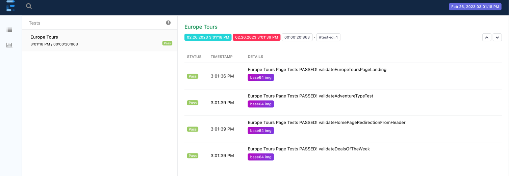

<h3> ToursRadar UI Tests </h3>

<i><strong>This project contains UI tests for Toursradar app, implemented using TestNg,Java(Selenium-Webdriver)</strong></i>

### Features
* Test cases defined and driven by TestNg.xml
* Maven build tool setup
* Page object model classes to define page objects/action methods.
* slf4j logging
* Utility methods for listeners and reporting.
* Properties file to drive environment test data.
* Support for automatic screenshot capture on failure
* Support for Extent-Spark-html-reports.

### To Get Started
#### Pre-requisites
- Install Java 8.x
- Install Maven
- Install IntelliJ or your favourite IDE

#### Project Setup
- Open IntelliJ
- From file menu open project -> select project root folder

#### Build
- Once the test project imports successfully through IntelliJ,run the tests with the help of 'mvn clean test' command

### Reports
- The Extent Spark report is integrated with maven and generates a report in HTML format.
- The HTML report location would be in /reports/ folder

#### Extent HTML report
The HTML report gives a graphical representation of the test results.
